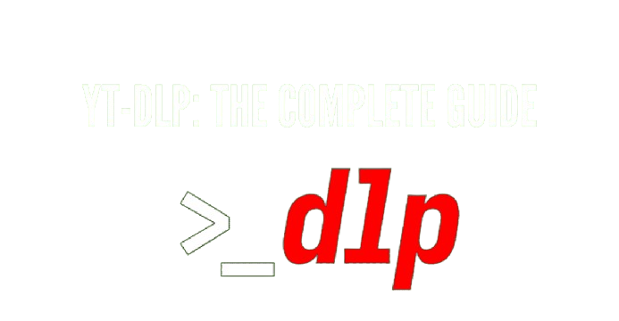
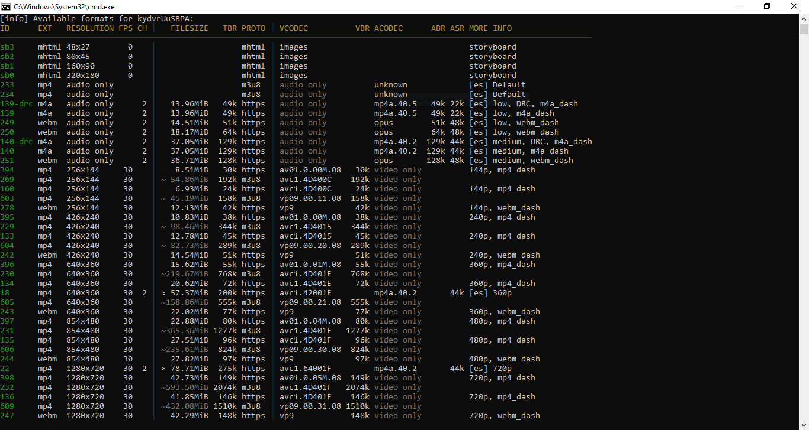
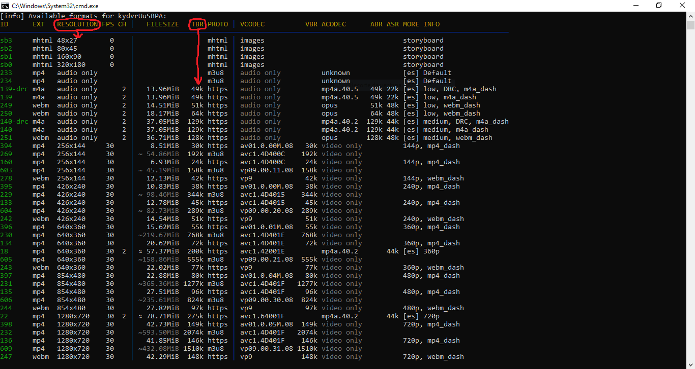
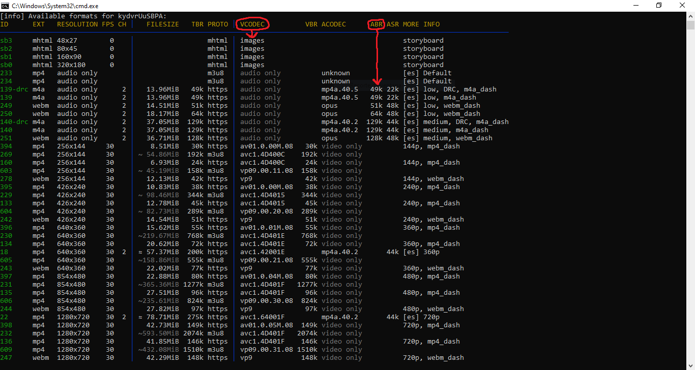

# youtube-dlp Documentación hecha por Sicer Andres Brito Gutierrez 👨‍💻
Manual de manejo e instalación ademas de instrucciones y recomendaciones


## Instalación

### Archivo ```.exe```
Puedes descargar directamente el archivo ejecutable si deseas realizar la instalación desde ```Windows``` y se te resulta mÁs fácil [Descargar archivo .exe](./yt-dlp.exe)

### Desde ```Chocolatey```
Esta fue la forma más facil y rapida en la que yo lo pude descargar, descargamos directamente el paquete ```yt-dlp``` utilizando ```chocolatey``` ya que estos paquetes se encuentran disponibles dentro de este gestor de paquetes en linea
  - 1. Instalación de ```chocolatey``` (Recordar que se hace en el Powershell como administrador). Documentación https://chocolatey.org/install  <br/><br/>
  Con PowerShell, debemos asegurarnos de que ```Get-ExecutionPolicy``` no esté restringido. Se sugiere usar ```Bypass``` para omitir la política para instalar cosas o ```AllSigned``` para obtener un poco más de seguridad.<br/><br/>
  Ejecutar ```Get-ExecutionPolicy```. Y si regresa Restricted, ejecute ```Set-ExecutionPolicy AllSigned``` o ```Set-ExecutionPolicy Bypass -Scope Process```.<br/><br/>
  Y ejecute ahora si este comando para realizar la instalación<br/><br/>
        ```
        Set-ExecutionPolicy Bypass -Scope Process -Force; [System.Net.ServicePointManager]::SecurityProtocol = [System.Net.ServicePointManager]::SecurityProtocol -bor 3072; iex ((New-Object System.Net.WebClient).DownloadString('https://community.chocolatey.org/install.ps1'))
        ```
        
        Si no se ve ningún error, ¡estara listo para usar ```Chocolatey```! Puedes escribir ```choco``` o ```choco -?``` para verificar la instalacion

  - 2. Instalación del paquete ```youtube-dlp``` <br/><br/>
       Simplemente ejecutamos desde la terminal el siguiente comando
    
          ```
          choco install yt-dlp
          ```
        Si la instalación sale exitosamente ya podremos descargar videos desde la terminal con este comando ```yt-dlp url```, aunque estos videos suelen descargarse con una resolución muy baja y se llegan a ver pixeleados

  - 3. Intalación del paquete ```ffmpeg``` <br/><br/>
  En este caso vamos a utilizar este paquete para que ```yt-dlp``` pueda combinar el video y el audio a la hora de descargar videos con la mayor calidad de video y de audio, además de que es requerido para poder ejecutar algunos comandos que vamos a ver y utilizar despues <br/><br/>
        <details>
        <summary>Descripción de este paquete</summary>
        <br>
        Descripción encontrada en la web
        <br><br>
        FFmpeg es el marco multimedia líder, capaz de decodificar, codificar, transcodificar, mux, demux, transmitir, filtrar y reproducir prácticamente cualquier cosa que los humanos y las máquinas hayan creado. Admite desde los formatos antiguos más oscuros hasta los más modernos. No importa si fueron diseñados por algún comité de estándares, la comunidad o una corporación. También es altamente portátil: FFmpeg compila, ejecuta y pasa nuestra infraestructura de prueba FATE en Linux, Mac OS X, Microsoft Windows, BSD, Solaris, etc. en una amplia variedad de entornos de compilación, arquitecturas de máquinas y configuraciones.
        </details>

        ---

  - 4. Comandos más útiles y comunes dentro de ```yt-dlp``` <br/><br/>
  Si deseas conocer todos los comandos disponibles de ```yt-dlp``` puedes ver la información del paquete dentro de la terminal utilizando el comando ```yt-dlp --help``` o ir a revisar directamente la documentación original https://github.com/yt-dlp/yt-dlp#usage-and-options <br/><br/>

        Los comandos que voy a colocar aqui son los que yo veo mas útiles y que pueden llegar a ser los que más utilizaremos <br/><br/>
  
    - 4.1 Comando para descargar un video
      ```
      yt-dlp URL
      ```
      Este comando descarga el video de la URL proporcionada

      ---

    - 4.2 Comando para listar formatos disponibles
      ```
      yt-dlp --list-formats URL
      ```
      Este comando muestra los formatos de video y audio disponibles para un video proporcionado de la URL

      

      En este caso la visualización de los formatos del video sera esta

      ---
    - 4.3 Comando para seleccionar el mejor video y audio y combinar
      ```
      yt-dlp -f bestvideo+bestaudio --merge-output-format mp4 URL
      ```
      Descarga y combina el mejor video y audio en un archivo MP4

      ---
    - 4.4 Comando para descargar solo el audio
      ```
      yt-dlp -f bestaudio --extract-audio --audio-format mp3 URL
      ```
      Descarga solo el audio y lo convierte a formato MP3

      ---
    - 4.5 Comando para especificar el nombre del archivo de salida
      ```
      yt-dlp -o "NOMBRE_DEL_ARCHIVO.%(ext)s" URL
      ```
      Permite personalizar el nombre del archivo de salida
      ```
      yt-dlp -o "NOMBRE_DEL_ARCHIVO.mp3" URL
      ```
      Además si queremos podemos modificar la extension de este archivo de esta formato de esta manera

      ---
    - 4.6 Comando para descargar una lista de reproducción completa
      ```
      yt-dlp --yes-playlist URL
      ```
      Descarga todos los videos de una lista de reproducción

      ---
    - 4.7 Comando para limitar la velocidad de descarga
      ```
      yt-dlp --limit-rate RATE URL
      ```
      Limita la velocidad de descarga para no saturar la conexión

      ---
    - 4.8 Comando para descargar subtítulos
      ```
      yt-dlp --write-sub --sub-lang LANG URL
      ```
      Descarga los subtítulos en el idioma especificado

      ---
    - 4.9 Comando para incrustar subtítulos
      ```
      yt-dlp --embed-subs URL
      ```
      Incrusta los subtítulos en el video

      ---
    - 4.10 Comando para usar archivo de cookies
      ```
      yt-dlp --cookies COOKIES_FILE URL
      ```
      Permite usar cookies para descargas que requieren autenticación

      ---

<br/>

  - 5. Como saber utilizar bien el comando ```--list-formats``` a la hora de descargar algo, debemos de tener en cuenta que entre mas grande sea el numero dentro de la columna vamos a identificarlo como la mejor opcion dentro de las disponibles <br/><br/>

    - 5.1 En caso de querer descargar un video dentro de la lista de formatos nos fijaremos en dos columnas ```RESOLUTION``` y ```TBR (Total Bitrate)```, debemos fijarnos tambien de no descargar un archivo muy pesado verificando la columna ```FILESIZE``` si queremos descargar el mejor archivo segun ```Calidad/Peso```, si es asi evita descargar los archivos con este simbolo ```~``` dentro de la columna ```FILESIZE``` porque son los que mas pesan dentro de las opciones disponibles 

      

      En este caso la mejor opción segun ```Calidad/Peso``` es el ```ID 398```.

      Este seria el comando para descargar el archivo de ```video``` seleccionado
      ```
      yt-dlp -f "398" URL
      ```

    - 5.2 En caso de querer descargar un audio dentro de la lista de formatos nos fijaremos en dos columnas ```ACODEC``` y ```ABR (Audio Bitrate)``` y escogemos el ID del audio que más nos convenga

      

      En este caso la mejor opción seria el ```ID 251``` debido a la calidad del audio ```128k```.

      Este seria el comando para descargar el archivo de ```audio``` seleccionado
      ```
      yt-dlp -f "251" URL
      ```

    Con estos comandos solo se descargaria cada archivo por separado, y aunque podemos descargarlos al mismo tiempo con este comando ```yt-dlp -f "398+251" URL``` seguirian descargandose por separado asi que la solución a este problema si es que queremos descargando unidos es con este comando
      ```
      yt-dlp -f "232+251" --merge-output-format mp4 https://youtu.be/kydvrUuSBPA
      ```

    Que lo que hace es unir ambos archivos y los convierte en formato ```mp4```

    Esta seria la opción si queremos verificar que es lo que vamos a instalar. Pero si queremos evitar este proceso o acortarlo podemos utilizar los siguientes comandos (Recordar que debemos de tener instalado el paqute ```ffmpeg```)

      ```
      yt-dlp -f "bestvideo+bestaudio" --merge-output-format mp4 URL
      ```

      ```
      yt-dlp -f "bestvideo[height<=720]+bestaudio/best[height<=720]" URL
      ```

      ```
      yt-dlp -f "bestvideo[ext=mp4]+bestaudio[ext=m4a]/best" URL
      ```

      <br/><br/>

> [!TIP]
> **DATO A TENER EN CUENTA:** Aunque la mayoría de las veces el no utilizar las comillas para los argumentos de ```-f``` como ```yt-dlp -f "251" URL``` a ```yt-dlp -f 251 URL``` pueden llegar a funcionar a la hora de ejecutarlos en la terminal se recomienda usar las comillas ya que garantiza que todo el argumento de la opción ```-f``` se interprete correctamente como un único argumento, especialmente en sistemas ```Unix``` como ```Linux``` o ```macOS``` donde es más común que se requieran comillas en tales casos

<br/>


### Documentación de comandos disponibles en la web
En esta pagina podemos ver algunos comandos que podremos utilizar para realizar la descarga de los videos en el caso de ralizar descargas con caracteristicas espesificas además de una documentación bastante completa
 - https://www.rapidseedbox.com/es/blog/yt-dlp-complete-guide#04

O leer la documentación oficial dejarnos de pendejadas 🤣🤣🤣
  - https://github.com/yt-dlp/yt-dlp#usage-and-options


